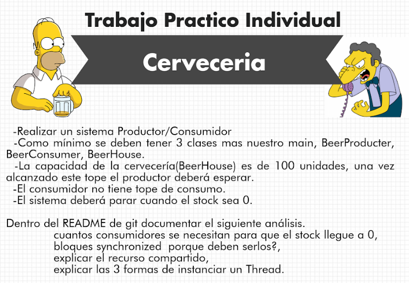

# Cerveceria
Java, Patrón Productor Consumidor

tp 2, Programacion avanzada.

## 1) Que Cantidad de Consumidores se necesita para que el stock llege a 0
- la cantidad de consumidores que se ha implementado es 1.
- Consume 1 producto a la vez.
- Consume la cantidad de veces que sea necesario(cantidad que fue produciendo el Productor)
- Si productor no produce, Consumidor queda a la espera.
- Cuando los productos sean 0, dejara de consumir.

##2) Bloques Synchronized, porque deben usarlos?
-El metodo synchronized evita que varios hilos interfieran entre si

Para Thread simplemente se usa el metodo start en una instancia del ojeto.

En cambio para Runnable se debe usar una instancia de Thread pasandole al constructor una instancia del objeto que implementa Runable 

## 3)Explicar las 3 formas de instanciar un thread

1. Extender de Clase Thread(yo utilice esta).
2. Implementar interface Runnable
3. Instanciar Thread, un new de thread.
en todos los casos hay q llamar al metodo start().

